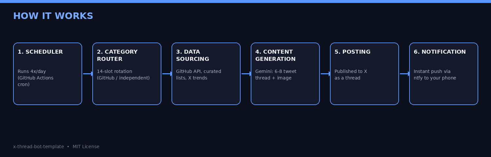

# 🧵 X Thread Bot — Automated Content on a Free/Cheap Stack

A template that automatically posts **threads** (6-8 connected tweets) to X:
trending GitHub repos, spotlights on effective (and lesser-known) AI tools,
current AI news, commentary that bridges whatever's trending on X to your own
niche, practical how-to guides, concept explainers, and head-to-head
comparisons — all running on a completely free cloud stack (GitHub Actions).

**This is a template repository.** Click **"Use this template"** at the top
right to copy it into your own account, plug in your own API keys, and you
have your own automated content bot. The code contains zero personal
information or API keys — everything comes from GitHub Secrets you set up
yourself.

⭐ **If you find this useful, please star the repo** — it helps others
discover it, and encourages continued development.

## Why this bot is different

Most "AI Twitter bots" fire off single, context-free promotional tweets that
read like ads. This template was deliberately designed to avoid that:

- 🎯 **Advice, not ads**: every tool spotlight is required to mention an
  honest limitation or drawback — not just praise
- 📚 **Not just "this exists" — "here's how to actually use it"**: a whole
  category group teaches real usage techniques for the tools it introduces
- 🔀 **Not stuck on GitHub**: only 6 of 14 categories are GitHub-sourced; the
  rest are fully independent educational content
- 📈 **Not disconnected from the conversation**: one category takes whatever
  is currently trending on X and bridges it to your niche (default: AI /
  software / GitHub) in a natural, non-forced way
- 🖼️ **Every thread has an image**: a real preview image when there's a
  source, or an automatically generated branded card when there isn't

## Features

- 🕐 Runs on a fixed schedule (default: 4x/day at peak hours) — no need to
  keep your computer on
- 🧠 Uses Google Gemini (with Google Search grounding) for content generation
  and real-time research
- 🧵 Substantial 6-8 tweet threads: opens with a hook, lists concrete
  features/benefits, gives a real example and comparison where relevant —
  rotates across 6 different hook techniques to avoid repetitive openers
- 📊 **X trend integration**: fetches current X trends once a day (to keep
  costs low), weaves them into content naturally when relevant, ignores them
  otherwise
- 🖼️ Automatic image on the first tweet: real preview image when a source
  exists (with a screenshot-API fallback), otherwise a branded card generated
  with Pillow
- 💸 Threads are posted **without a link** to keep costs down; you get an
  instant ntfy.sh push notification and manually add the source link as a
  reply
- 🚫 A keyword filter automatically skips strategically risky topics (e.g.
  projects that are direct alternatives to the platform itself)
- 🔁 Built-in memory to avoid repeats and keep hook variety (`state.json`)
- 🌍 **Fully localizable output** — change one variable (`OUTPUT_LANGUAGE`) to
  have the bot write in Turkish, Spanish, German, or any other language
- ⚙️ Expand the content pool by editing plain JSON files — no coding required

## Estimated cost

At 4 threads/day × ~7 tweets average ≈ 840 tweets/month:

| Item | Estimated monthly cost |
|---|---|
| X API (pay-per-use, writes) | ~$12-13 |
| Gemini API (Pro model) | ~$2 |
| Google Search grounding | ~$1.5 |
| X trend tracking (optional) | ~$1-2 |
| ntfy.sh notifications | $0 |
| GitHub Actions | $0 |
| **Total** | **~$17-18/month** |

You can easily cut this in half by lowering the posting frequency (e.g. 2
threads/day) or shortening threads (`MIN_THREAD_LEN`/`MAX_THREAD_LEN` in
`main.py`).

## Setup

### 1. Use this template

Click **"Use this template"** at the top right to create your own repo.
We recommend keeping it **private**.

### 2. Set up the required accounts/keys

**a) Gemini API key (Google)**
1. Go to https://aistudio.google.com and sign in with a Google account
2. "Get API Key" → "Create API Key"
3. Enable billing (needed for the Pro model + Google Search grounding)

**b) X (Twitter) Developer account**
1. Apply for a developer account at https://developer.x.com
2. Create an "App" with **Read and Write** permissions, type **"Web App,
   Automated App or Bot"**
3. In "Keys and tokens", grab the 4 OAuth 1.0 keys: API Key, API Key Secret,
   Access Token, Access Token Secret
4. (Optional, for trend tracking) On the same page, also "Generate" a
   **Bearer Token** — no separate application needed
5. Add a payment method and load pay-per-use credits

**c) ntfy.sh notification topic (free, no account needed)**
1. Make up a hard-to-guess topic name just for yourself
2. Install the ntfy app on your phone and subscribe to that topic

**d) Screenshot API key (optional, image fallback)**
- Sign up for a free account at https://snap-render.com (200 free
  screenshots/month, no credit card).

### 3. Add GitHub Secrets

**Settings → Secrets and variables → Actions → New repository secret**:

- `GEMINI_API_KEY`
- `X_API_KEY`
- `X_API_SECRET`
- `X_ACCESS_TOKEN`
- `X_ACCESS_SECRET`
- `NTFY_TOPIC`
- `SCREENSHOT_API_KEY` (optional)
- `X_BEARER_TOKEN` (optional, for trend tracking)

### 4. (Optional) Add repository variables for localization

Still in **Settings → Secrets and variables → Actions**, but under the
**Variables** tab this time (these aren't secret, just config):

- `OUTPUT_LANGUAGE` — e.g. `Turkish`, `Spanish`, `German` (default: `English`)
- `TRENDS_WOEID` — the WOEID for your target region's X trends (default: `1`,
  worldwide; e.g. `23424977` for the United States)

### 5. Enable Actions

Go to the **Actions** tab and enable the workflow. Adjust the `cron` lines in
`.github/workflows/post.yml` if you want a different schedule or timezone
(GitHub Actions cron always runs in UTC).

### 6. Customize for your own niche

- `ai_tools.json` — the list of AI tools to spotlight (comes with 46 ready to
  go)
- `github_tips.json`, `concept_topics.json`, `howto_topics.json`,
  `comparison_topics.json` — your own topic lists
- `CATEGORIES` in `main.py` — rotation order/weighting
- `TOPIC_QUERIES` in `main.py` — which GitHub topics get searched
- `BLOCKED_KEYWORDS` in `main.py` — keywords to auto-filter
- The `trend_take` branch inside `build_thread_prompt` — customize which
  niche trends get bridged to (default: AI/software/GitHub)

## Content categories (14-slot rotation)

**GitHub-sourced (6/14):** `trending_repo`, `opensource_saas`,
`automation_tool`, `beginner_github_tip`, `useful_skill_tool`, `game_dev_tool`

**Fully independent, purely educational (8/14):** `ai_tool_intro` (×2),
`ai_news`, `concept_explainer`, `practical_howto` (×2), `comparison`,
`trend_take`

## The link-adding workflow

1. The bot posts the thread; you get an ntfy push notification
2. Tap the notification to open the source / last tweet
3. In the X app, reply to the **last tweet in the thread** with the source
   link, by hand

## Contributing

New content category ideas, bug fixes, or ports to other platforms (Mastodon,
LinkedIn) are welcome as pull requests.

## Disclaimer

This project is provided "as is" under the MIT License. You're responsible
for complying with X's and Google's terms of service, monitoring your own API
costs, and reviewing the accuracy of the content it posts.
